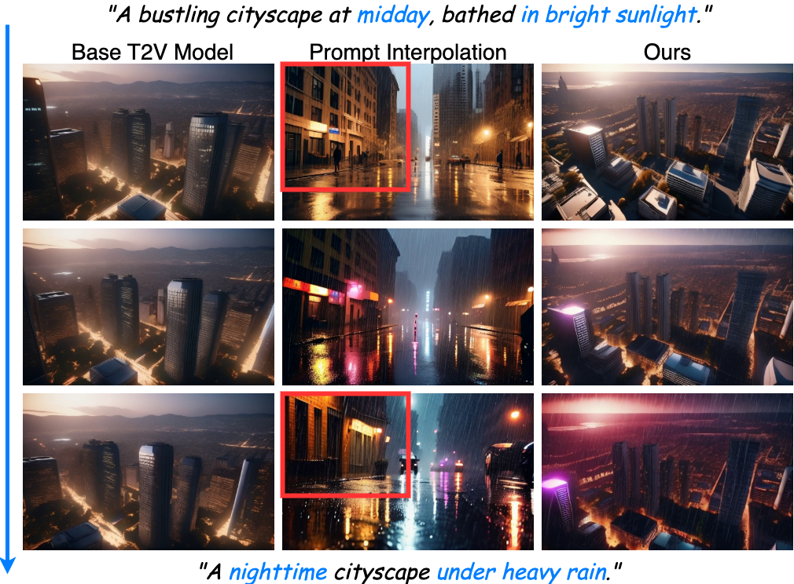
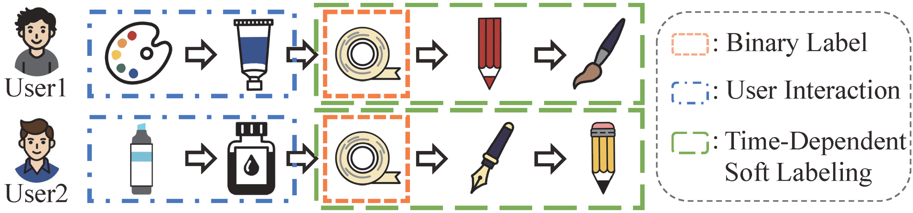
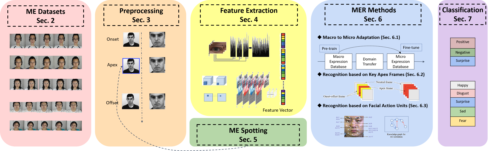
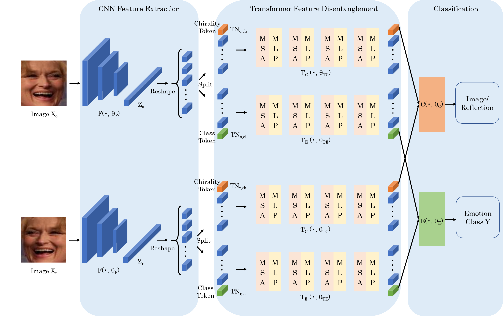
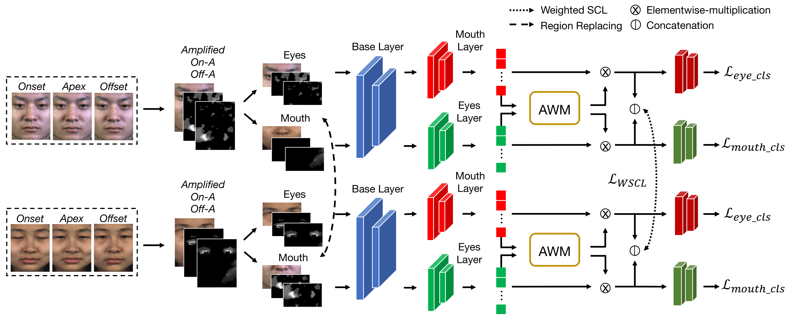
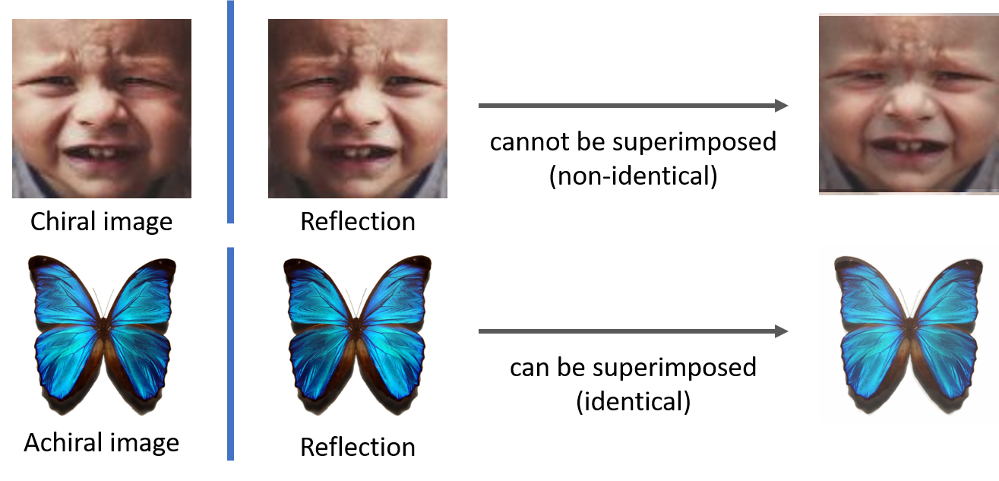
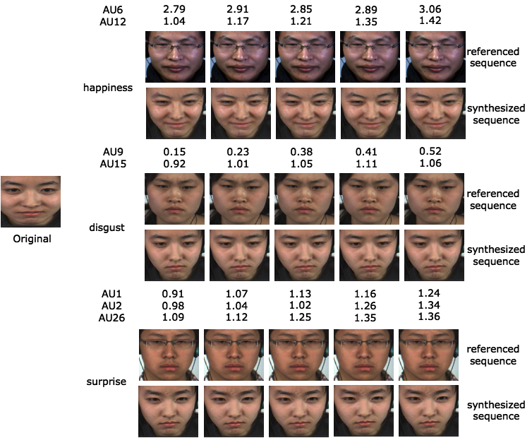
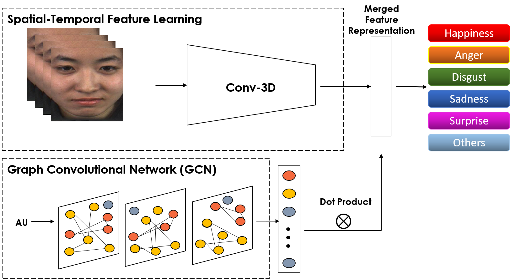
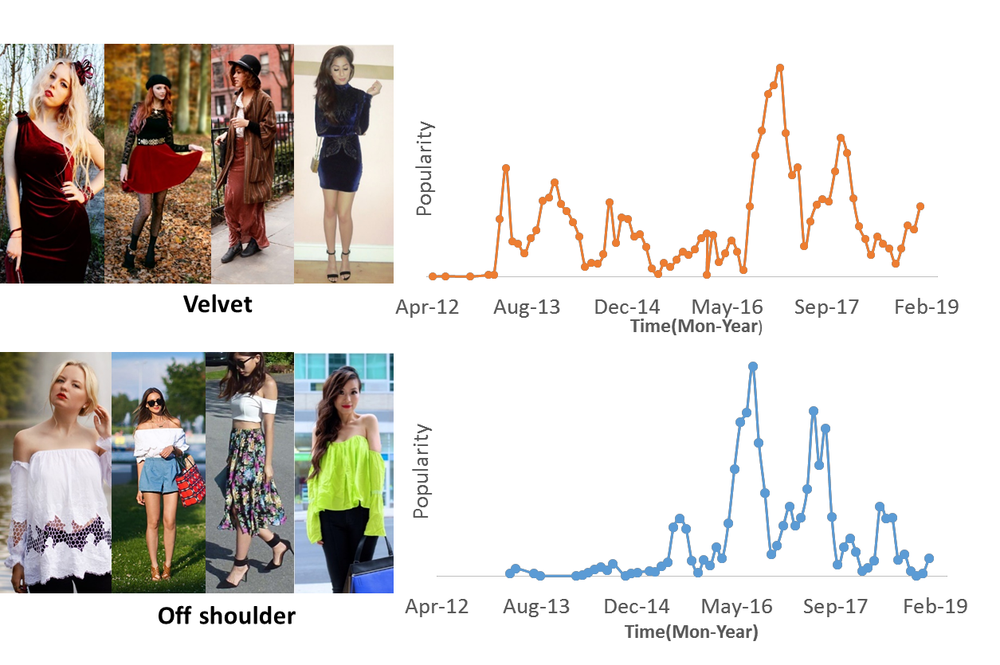


  
Please find the full list of my works on <a href="{{site.author.googlescholar}}">my Google Scholar profile</a>.






  


## Selected Publications

  

    
  

  

    <h3 style="margin-top: 0; margin-bottom: 8px;">From Prompt to Progression: Taming Video Diffusion Models for Seamless Attribute Transition </h3>
    
<strong>Ling Lo</strong>, Kelvin C.K. Chan, Wen-Huang Cheng, Ming-Hsuan Yang

    
<em>ICCV 2025</em>

    
<a href="https://arxiv.org/abs/2509.19690">Paper</a> | <a href="https://github.com/lynn-ling-lo/Prompt2Progression">Code</a>

  

---

  

    
  

  

    <h3 style="margin-top: 0; margin-bottom: 8px;">Future Sight and Tough Fights: Revolutionizing Sequential Recommendation with FERec</h3>
    
Yu-Hsuan Huang, <strong>Ling Lo</strong>, Hongxia Xie, Hong-Han Shuai, Wen-Huang Cheng

    
<em>AAAI 2025</em>

    
<a href="https://arxiv.org/abs/2412.11589">Paper</a> | <a href="https://github.com/uikdwnd/FENRec">Code</a>

  

---

  

    
  

  

    <h3 style="margin-top: 0; margin-bottom: 8px;">Distraction is All You Need: Memory-Efficient Image Immunization against Diffusion-based Image Editing</h3>
    
<strong>Ling Lo</strong>, ChengYu Yao, Hong-Han Shaui, Wen-Huang Cheng

    
<em>CVPR2024 🌟<strong>Highlight</strong></em>

    
<a href="[link-to-pdf](https://openaccess.thecvf.com/content/CVPR2024/papers/Lo_Distraction_is_All_You_Need_Memory-Efficient_Image_Immunization_against_Diffusion-Based_CVPR_2024_paper.pdf)">Paper</a> | <a href="https://github.com/lynn-ling-lo/DAYN">Code</a>

  

---

  

    
  

  

    <h3 style="margin-top: 0; margin-bottom: 8px;">ReCorD: Reasoning and Correcting Diffusion for HOI Generation</h3>
    
Jian-Yu Jiang-Lin, Kang-Yang Huang, <strong>Ling Lo</strong>, Yi-Ning Huang, Terence Lin, Jhih-Ciang Wu, Hong-Han Shuai, Wen-Huang Cheng

    
<em>ACM MM 2024</em>

    
<a href="https://arxiv.org/abs/2407.17911">Paper</a> | <a href="https://github.com/j1anglin/ReCorD">Code</a>

  

---

  

    
  

  

    <h3 style="margin-top: 0; margin-bottom: 8px;">Modeling Uncertainty for Low-Resolution Facial Expression Recognition</h3>
    
<strong>Ling Lo</strong>, Bo-Kai Ruan, Hong-Han Shuai, Wen-Huang Cheng

    
<em>TAFFC 2023</em>

    
<a href="https://ieeexplore.ieee.org/document/10098204">Paper</a>

  

---

  

    
  

  

    <h3 style="margin-top: 0; margin-bottom: 8px;">Facial Chirality: From Visual Self-Reflection to Robust Facial Feature Learning</h3>
    
<strong>Ling Lo</strong>, Hongxia Xie, Hong-Han Shuai, Wen-Huang Cheng

    
<em>TMM 2022</em>

    
<a href="https://ieeexplore.ieee.org/document/9852298">Paper</a>

  

---

  

    
  

  

    <h3 style="margin-top: 0; margin-bottom: 8px;">Mimicking the Annotation Process for Recognizing the Micro-Expresion.</h3>
    
Bo-Kai Ruan, <strong>Ling Lo</strong>, Hong-Han Shuai, Wen-Huang Cheng

    
<em>ACM MM 2022</em>

    
<a href="https://dl.acm.org/doi/10.1145/3503161.3548185">Paper</a>|<a href="https://github.com/Justin900429/mimicking-annotation-micro-expression-recognition">Code</a>

  

---

  

    
  

  

    <h3 style="margin-top: 0; margin-bottom: 8px;">An Overview of Facial Micro-Expression Analysis: Data, Methodology and Challenge</h3>
    
Hongxia Xie,<strong>Ling Lo</strong>, Hong-Han Shuai, Wen-Huang Cheng

    
<em>TAFFC 2022</em>

    
<a href="https://ieeexplore.ieee.org/document/9684697">Paper</a>

  

---

  

    
  

  

    <h3 style="margin-top: 0; margin-bottom: 8px;">Facial Chirality: Using Self-Face Reflection to Learn Discriminative Features for Facial Expression Recognition</strong></h3>
    
<strong>Ling Lo</strong>, Hongxia Xie, Hong-Han Shuai, Wen-Huang Cheng

    
<em>ICME 2021  🏆<strong>Best Paper Award</strong></em>

    
<a href="https://ieeexplore.ieee.org/document/9428120">Paper</a>

  

---

  

    
  

  

    <h3 style="margin-top: 0; margin-bottom: 8px;">Fashionmirror: Co-Attention Feature Remapping Virtual Try-on with Sequential Template Poses</h3>
    
Chieh-Yun Chen, <strong>Ling Lo</strong>, Pin-Jui Huang, Hong-Han Shuai, Wen-Huang Cheng

    
<em>ICCV 2021</em>

    
<a href="https://openaccess.thecvf.com/content/ICCV2021/papers/Chen_FashionMirror_Co-Attention_Feature-Remapping_Virtual_Try-On_With_Sequential_Template_Poses_ICCV_2021_paper.pdf">Paper</a>

  

---

  

    
  

  

    <h3 style="margin-top: 0; margin-bottom: 8px;">AU-Assisted Graph Attention Convolutional Network for Micro-Expression Recognition</h3>
    
Hongxia Xie, <strong>Ling Lo</strong>, Hong-Han Shuai, Wen-Huang Cheng

    
<em>ACM MM 2020</em>

    
<a href="https://basiclab.lab.nycu.edu.tw/assets/AU-GACN+AU-ICG_MM2020.pdf">Paper</a>

  

---

  

    
  

  

    <h3 style="margin-top: 0; margin-bottom: 8px;">MER-GCN: Micro-Expression Recognition Based on Relation Modeling with Graph Convolutional Networks</h3>
    
Hongxia Xie, <strong>Ling Lo</strong>, Hong-Han Shuai, Wen-Huang Cheng

    
<em>MIPR 2020</em>

    
<a href="https://arxiv.org/abs/2004.08915">Paper</a>

  

---

  

    
  

  

    <h3 style="margin-top: 0; margin-bottom: 8px;">Dressing for Attention: Outfit-based fashion Popularity Prediction</h3>
    
<strong>Ling Lo</strong>, Chia-Lin Liu, Rong-An Lin, Bo Wu, Hong-Han Shuai, Wen-Huang Cheng

    
<em>ICIP 2019</em>

    
<a href="https://ieeexplore.ieee.org/document/8803461">Paper</a>

  

